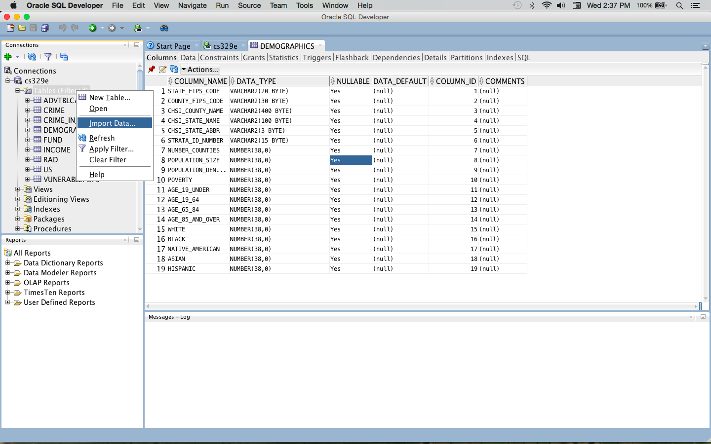
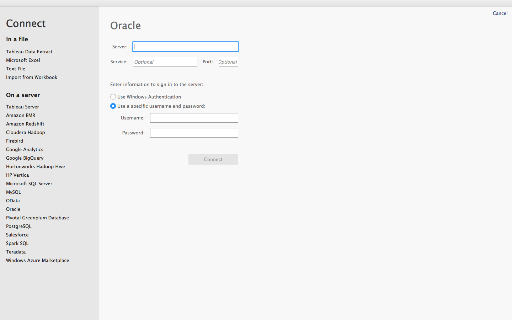
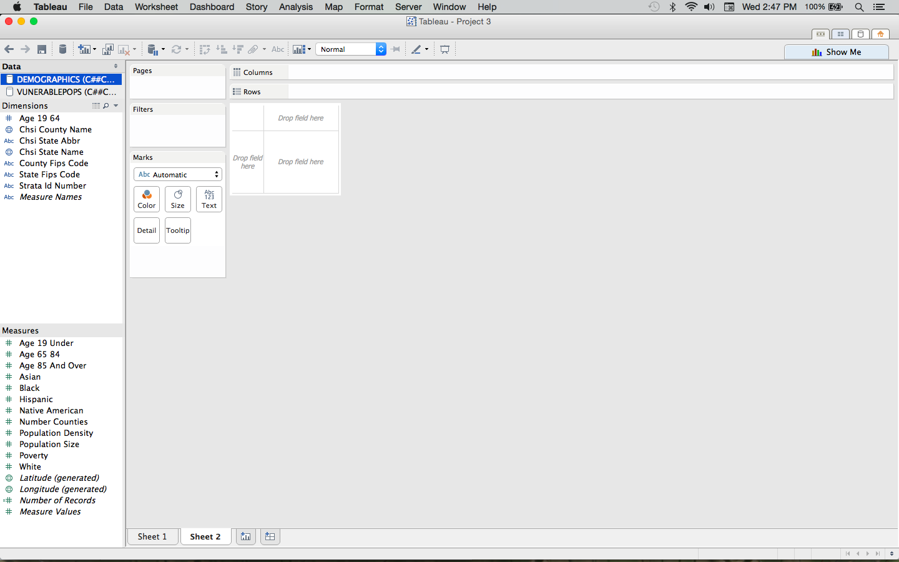
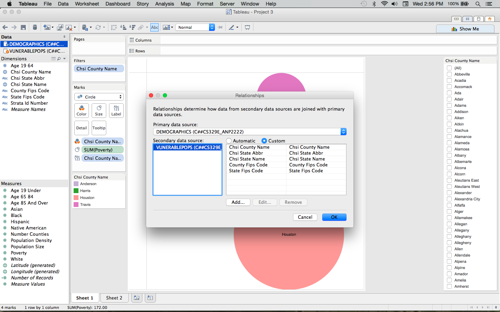
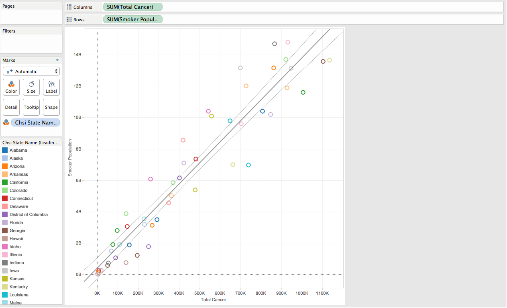
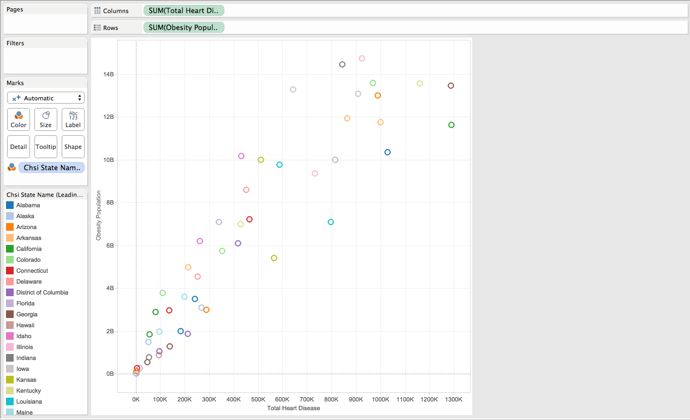
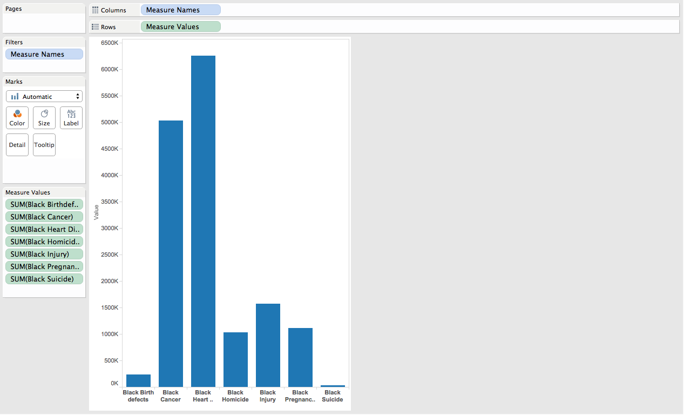
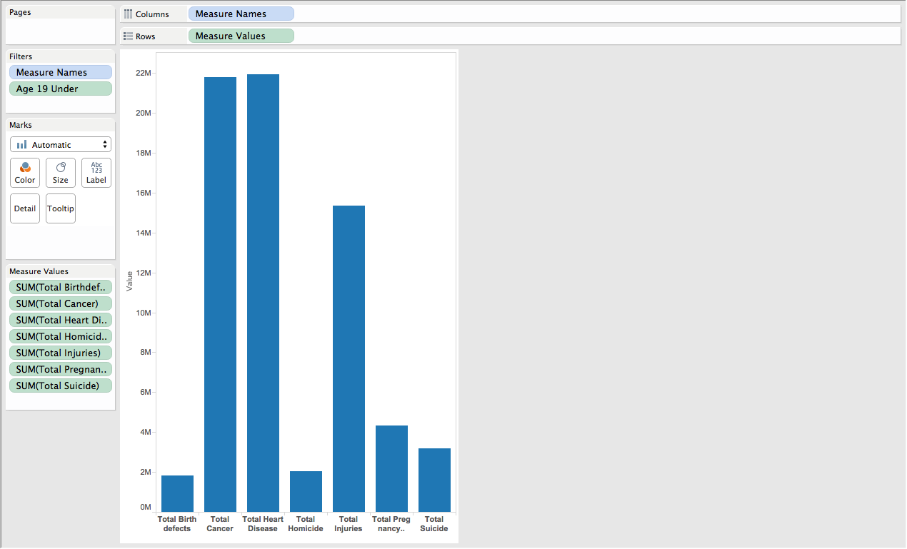
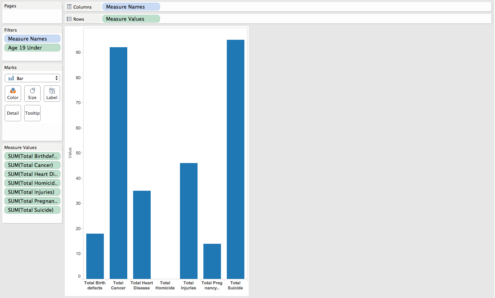

***
***
For "Tableau Project 3", we use the data for "Community Health Status Indicators (CHSI) to Combat Obesity, Heart Disease and Cancer". This dataset has multiple csv files that give key health indicators that are measured for several counties across all the states in the United States. Columns included in the dataset are deaths from different causes, demographics of the area, cases of diseases, health information, insurance and health practitioner data. 

First, open Oracle SQL Developer and import the data for DEMOGRAPHICS, LEADINGCAUSESOFDEATH (renamed LEADING_CAUSES) and RISKFACTORSANDACCESSTOCARE (renamed RISK_FACTORS). Or skip this step and connect to the cs329e server with the respective UTEid's. 

Next, open Tableau and select "Connect to Data". Select Oracle from the list of servers and connect using:

Server: 129.152.144.84

Service: ORCL.usuniversi01134.oraclecloud.internal

Port: 1521

Username: C##cs329e_UTEid

Password: orcl_UTEid

The purpose of this project is to "blend" two datasets together on Tableau, similar to joining but still having separate datasets rather than a single joined table. The data will have to be connected separated (i.e. you will have to connect to data twice and choose each separately). When both datasets are seen under the data column on the left, 

then select Data at the top menu and "Edit Relationships". Here, you can choose which is the primary and secondary data source. To customize the linked relationships, select Custom and the **Add** to choose the primary and secondary source field. Source fields can only be dimension variables and not measures. 

Connected data will show check marks and the secondary data will have linking chains next to the dimension names. 

####Blending LEADING_CAUSES and RISK_FACTORS

The following two visualizations blend LEADING_CAUSES and RISK_FACTORS. 

**1. Relationship between Cancer and Smoking**

Smoking, from RISK_FACTORS, is a risk indicator of later health complications such as the predicted lung cancer. Cancer is not divided by target, such as lung, breast, etc. but we assume that it is an indicator regardless. A calculated field of total cancer deaths is created and this is set on one axis compared to smoking individuals. We see a slight correlation between the two as expected as seen by the scatterplot and the trendline. 

**2. Heart disease vs Obesity**

Now obesity is the risk factor compared to the cause of death from heart disease. Similar to the previous visualization we will use a scatterplot to see the correlation, if there is any, between the stereotypically associated variables. Number of obese individauls are plotted with the population portion that have died as a result of heart disease. Again a calculated field was created to sum all the deaths that related to heart disease. 

A fan pattern is visible that shows a linear correlation of greater number of heart disease as a cause of death when there is a larger obesity population.

####Blending DEMOGRAPHICS and LEADING_CAUSES

For the last two visualizations, DEMOGRAPHICS data was blended with LEADING_CAUSES instead. 

**3. Distribution of Causes of Death according to Race**

Causes of death are grouped by age and race. We chose to look into a particular race over all age ranges and look for patterns of leading causes of death. Here is a normal distribution for all records for American Black people. Each bar is a calculated field aggregating all age ranges for that cause of death.

Cancer and heart disease are the highest causes of death for black population. Possible causes are lack of adequate healthcare or a genetic predisposition. 

**4. Age and Causes of Death**

This final visualization looks into the cause of death distribution between age ranges. We looked to find a correlation between counties with a high percentage of individuals under the age of 19 and suicide as a leading cause of death.  The first graph shows the normal distribution of leading causes of death across all counties. The second graph filters for a high percentage of younger people. Based on the bar graph we see that individuals under 19 are dying mostly from cancer and suicide compared to other causes. The amount of suicide in these counties with many young people is drastically higher than the normal distribution.

